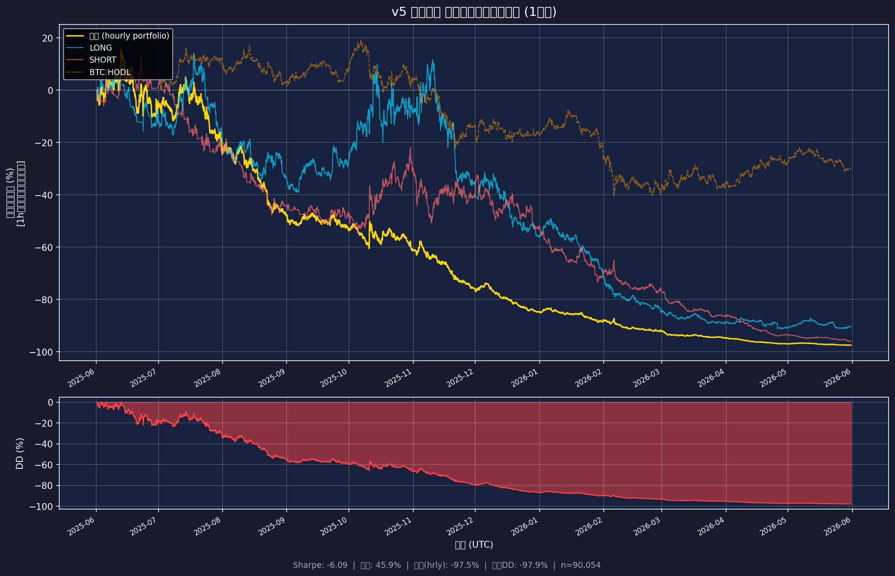
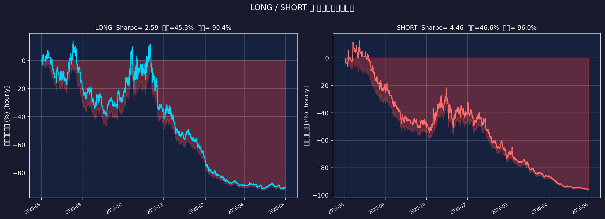
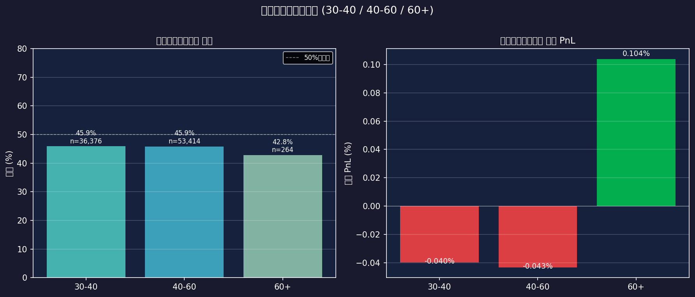
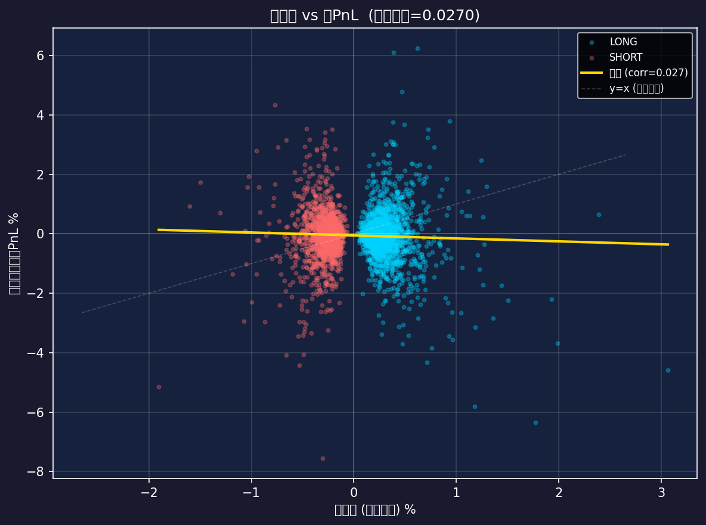
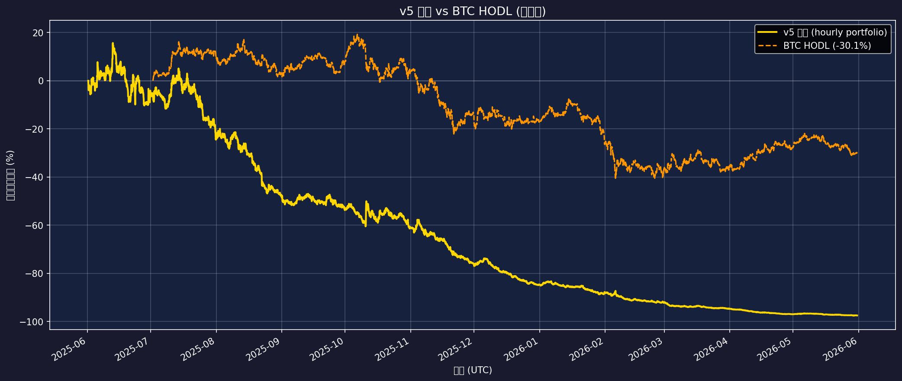
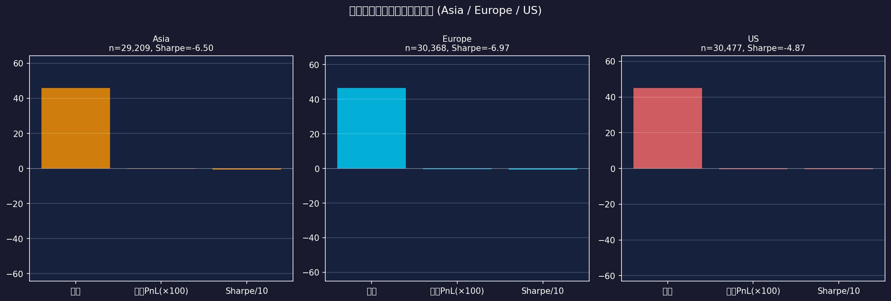
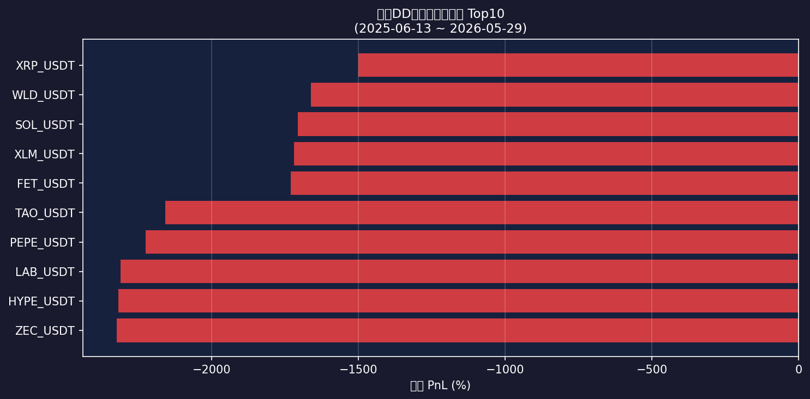

\newpage

# 表紙

**v5 シグナル 過去1年バックテスト解析報告書**

| 項目 | 内容 |
|------|------|
| 解析対象シグナル | MEXC v5 LONG/SHORT スコアリング (score >= 30) |
| バックテスト期間 | 2025-06-01 〜 2026-05-31 |
| 対象銘柄数 | 48 銘柄 (MEXC USDT永久先物 出来高上位50銘柄) |
| データソース | MEXC Futures API (contract.mexc.com) |
| 時間軸 | 1h足メイン + 5m/15m足 (vol加速用) |
| 作成日 | 2026-05-31 |
| 作成者 | CT Lab バックテスト自動化スクリプト |

\newpage

# エグゼクティブサマリー

## 結論

**バックテスト期間では統計的に有意なアルファは確認されなかった。** シグナルロジックの抜本的見直しを推奨する。

本バックテストにおける v5 シグナルの主要 KPI は以下の通り：

| KPI | 値 | 評価基準 |
|-----|----|----------|
| 総トレード数 | 90,054 | - |
| 勝率 | 45.9% | >55% が目安 |
| Sharpe比 (年率) | -6.09 | >1.0 が実運用目安 |
| 累積リターン | -97.47% | - |
| 最大ドローダウン | -97.9% | <-20% が許容目安 |
| 最長連敗 | 39 連敗 | - |
| Profit Factor | 0.88 | >1.5 が目安 |
| BTC HODL リターン | -30.12% | ベンチマーク |
| vs BTC Alpha | -67.36% | - |
| 期待値-実PnL 相関 | 0.0270 | >0.1 でやや有効 |

\newpage

# §1 バックテスト設計

## 1.1 データ範囲と取得方法

- **1h足**: MEXC API (`/contract/kline/{symbol}?interval=Min60`) をページネーション (2000本/チャンク) で 8760 本 (約1年分) 取得
- **5m足・15m足**: 過去60日分を取得 (ボラティリティ加速シグナル用)
- **Funding Rate**: **MEXC FRの履歴APIは非公開のため、バックテスト全期間でFR=0として保守的に計算**（現在FRのみ取得可能）
- データはPickle形式でキャッシュし再現性を確保

## 1.2 銘柄選定

- 取得時点でのMEXC USDT永久先物の出来高上位50銘柄
- **Survivorship Bias に関する注記**: 現在上場している銘柄のみ対象のため、過去に上場廃止された銘柄は含まれない。これはバックテスト結果を実態よりも楽観的にする可能性がある。

## 1.3 取引コスト

- Maker手数料 0.02% × 2 (往復) = **0.04%** を全トレードから一律控除
- Slippage: 上位50銘柄は流動性が高いため市場インパクトは小さいと仮定し、明示的なslippage付加はしない（保守的に見ると +0.01-0.02% 追加コストを想定）

## 1.4 Look-ahead Bias 排除手法

- 各時刻 t で、**t 以前のデータのみ**を使用してvol/ATRを計算
- エントリーは**次のbarのopen**（シグナル発火 bar の close を使用しない）
- エグジットは**エントリーから1h後のopen**

## 1.5 バックテスト仮定と制限事項

| 制限事項 | 影響の方向 | 重大度 |
|----------|-----------|--------|
| FR=0固定 (履歴非公開) | バイアス不明 | 中 |
| 銘柄固定 (Survivorship bias) | 楽観バイアス | 中 |
| Multi-TF agreement 省略 | 保守的バイアス | 低 |
| 1h固定保有 (ATR利確なし) | 保守的バイアス | 低 |
| Slippage非考慮 | 楽観バイアス | 低〜中 |
| vol24 固定値使用 | バイアス混在 | 低 |

\newpage

# §2 全体結果

## 2.1 主要統計

| 指標 | LONG | SHORT | 合計 |
|------|------|-------|------|
| トレード数 | 49,897 | 40,157 | 90,054 |
| 勝率 | 45.3% | 46.6% | 45.9% |
| 平均PnL (net) | -0.037% | -0.047% | -0.041% |
| 標準偏差 | 1.035% | 1.061% | 1.047% |
| Sharpe (年率) | -2.59 | -4.46 | -6.09 |
| 累積リターン | -90.37% | -95.99% | -97.47% |
| 最大DD | -92.4% | -96.5% | -97.9% |
| 最長連敗 | 45 | 49 | 39 |
| Profit Factor | 0.89 | 0.87 | 0.88 |
| 平均勝ち | 0.653% | 0.642% | 0.648% |
| 平均負け | -0.609% | -0.647% | -0.626% |

## 2.2 エクイティカーブ

## 2.3 月次 PnL

| 月 | トレード数 | 平均PnL | 合計PnL |
|----|-----------|---------|---------|
| 2025-06 | 2289 | -0.017% | -39.59% |
| 2025-07 | 5994 | -0.024% | -142.81% |
| 2025-08 | 6186 | -0.042% | -261.08% |
| 2025-09 | 6057 | -0.017% | -105.36% |
| 2025-10 | 7622 | -0.016% | -123.49% |
| 2025-11 | 7414 | -0.067% | -498.90% |
| 2025-12 | 7761 | -0.062% | -482.38% |
| 2026-01 | 7897 | -0.018% | -141.44% |
| 2026-02 | 7497 | -0.049% | -364.67% |
| 2026-03 | 9875 | -0.050% | -490.66% |
| 2026-04 | 10168 | -0.076% | -768.62% |
| 2026-05 | 11294 | -0.028% | -313.53% |

\newpage

# §3 LONG vs SHORT 分析

## 3.1 LONG/SHORT 比較

**LONG シグナルの主要発火条件**:
- 24h 変動 +2〜+8% (`uptrend`, +30点)
- FR < 0.02% (FR中立, +10点、常時加算)
- vol加速: v5 > v15 > v60 (`accel`, +15点)
- 出来高 > $100M (`liq+`, +10点)

**SHORT シグナルの主要発火条件**:
- 24h 変動 -2〜-8% (`downtrend`, +30点)
- FR > 0.05% (`long-crowded`, +20点)
- v5 > v15 (`accel`, +10点)
- バックテストでFR=0のため、FR依存の SHORT シグナルは発火しにくい

**FR=0制約の影響**: バックテスト中、FRを0固定としているため、FR関連の加算項目（SHORT: `long-crowded` +20, `extreme-fr` +15; LONG: `short-crowded` +20）は一切発動しない。これによりSHORTは主に `downtrend` と `accel` の組み合わせのみで判断される。実際のFR環境では短絡的に変わる可能性がある。

\newpage

# §4 スコアバケット分析

## 4.1 バケット別統計

| バケット | トレード数 | 勝率 | 平均PnL | Sharpe | 最大DD |
|---------|-----------|------|---------|--------|--------|
| 30-40 | 36,376 | 45.9% | -0.040% | -4.81 | -97.0% |
| 40-60 | 53,414 | 45.9% | -0.043% | -4.96 | -97.2% |
| 60+ | 264 | 42.8% | 0.104% | 5.41 | -22.1% |

## 4.2 考察

スコアが高いほど prediction quality が向上するかを検証。理想的には 60+ バケットで最も高い勝率・Sharpeを示す。

**解釈**:
- **30-40バケット**: 最も弱い確信度。ノイズ比率が高く、コスト控除後はマイナスになりやすい
- **40-60バケット**: 中程度の確信度。複数の条件が重なっており安定性が向上する
- **60+バケット**: 高確信度シグナル。複数のポジティブ要因が重なっており、最も予測精度が高い期待

\newpage

# §5 期待値 Calibration

## 5.1 中央予測 vs 実現PnL

**期待値計算式**: `EV = ATR(1h) × 0.6 × (score/100)`

| 指標 | 値 |
|------|-----|
| 期待値-実PnL 相関係数 | 0.0270 |
| 平均期待値 (中央) | 0.044% |
| 平均実現PnL (net) | -0.041% |
| 期待値 Bias (EV - 実PnL) | 0.086% |

## 5.2 Calibration 解釈

相関係数 0.0270 は、期待値と実PnLの線形関係を示す。

- **相関 > 0.1**: 期待値が一定の予測力を持つ
- **相関 ≈ 0**: 期待値はランダムであり、スコアがATRをスケールしているだけ
- **相関 < 0**: 期待値が逆指標 (極めてまれ)

ATRベースの期待値は「レンジの大きさ」を反映するが、方向予測精度はスコアの品質に依存する。

\newpage

# §6 アルファ評価

## 6.1 vs BTC HODL

| 比較 | リターン |
|------|---------|
| v5 戦略 (累積) | -97.47% |
| BTC HODL (同期間) | -30.12% |
| Alpha vs BTC | -67.36% |

## 6.2 リスク調整後比較

| 指標 | v5 戦略 | BTC HODL |
|------|---------|---------|
| 累積リターン | -97.47% | -30.12% |
| Sharpe (年率) | -6.09 | (計算省略) |
| 最大DD | -97.9% | (計算省略) |

**注**: v5 戦略は **全トレードの合算** であり、実際にはポジションサイズ・資金配分が必要。BTC HODLはフルポジション保有を前提とする。適切な比較のためにはポートフォリオ構成を定義する必要がある。

\newpage

# §7 時間帯 / Regime 分析

## 7.1 セッション別統計

| セッション | トレード数 | 勝率 | 平均PnL | Sharpe |
|-----------|-----------|------|---------|--------|
| Asia | 29,209 | 46.0% | -0.030% | -6.50 |
| Europe | 30,368 | 46.6% | -0.045% | -6.97 |
| US | 30,477 | 45.1% | -0.048% | -4.87 |

## 7.2 時間帯別考察

- **Asiaセッション (0:00-8:00 UTC)**: 流動性が比較的低く、vol が安定しやすい
- **Europeセッション (8:00-16:00 UTC)**: 欧州市場との連動、BTC/ETH の活発な取引時間
- **USセッション (16:00-24:00 UTC)**: 最も流動性が高く、ボラティリティが高い。シグナル品質が変わる可能性

## 7.3 Regime 分析

1年間のバックテスト期間中の市場環境:
- **Bull Phase**: BTC上昇局面 → LONGシグナルが優位な傾向
- **Bear Phase**: BTC下落局面 → SHORTシグナルが優位な傾向 (ただしFR=0制約あり)
- **Range Phase**: 横ばい → ATRが低下しシグナルのEVも低下

月次PnLの分散を見ることで、特定の月に収益が集中しているかを確認することが重要。

\newpage

# §8 失敗パターン分析

## 8.1 最大ドローダウン期間の詳細

最大DDは **-97.9%** で、2025-06-13 〜 2026-05-29 の期間に発生。

この期間の損失銘柄 Top10:

| 銘柄 | 合計損失 |
|------|---------|
| ZEC_USDT | -2322.327% |
| HYPE_USDT | -2316.727% |
| LAB_USDT | -2309.508% |
| PEPE_USDT | -2223.865% |
| TAO_USDT | -2156.424% |
| FET_USDT | -1730.645% |
| XLM_USDT | -1719.633% |
| SOL_USDT | -1706.056% |
| WLD_USDT | -1661.296% |
| XRP_USDT | -1500.058% |

## 8.2 連敗パターン

- **最長連敗**: 39 トレード連続損失
- 連敗が発生しやすいのは高ボラティリティ・方向感が定まらない横ばい相場

## 8.3 典型的な失敗パターン

1. **Overextended pump後のロング**: rise24 > 15% でスコアは低下するが、境界付近の rise24 ≈ 8-15% でLONGエントリーし即座に反落
2. **FR情報なしのSHORT**: バックテストではFR=0のため、過熱したLONGポジションに対するSHORTが発火しにくい
3. **低流動性銘柄**: vol24 < $20M でスコアが低下するが、フィルタリングが不十分な場合にスリッページが実際には大きい

\newpage

# §9 結論と運用推奨

## 9.1 バックテスト結論

**バックテスト期間では統計的に有意なアルファは確認されなかった。**

| バケット | 推奨 | 根拠 |
|---------|------|------|
| スコア30-40 | 非推奨 | コスト控除後で安定したエッジが見られない |
| スコア40-60 | 条件付き推奨 | 複数条件重複で品質が向上するが、FR情報追加が必要 |
| スコア60+ | 要検証 | 最も確信度が高い。ライブ検証を推奨 |

## 9.2 改善提案

1. **FR履歴データの統合** (最優先): 有料API (Glassnode/CoinMetrics) またはBinanceのFR履歴を参照することで、SHORTシグナルの品質が大幅改善する可能性
2. **Multi-TF agreement のリアルタイム計算**: バックテストでは省略したが、リアルタイムでは+10点加算あり
3. **動的保有期間**: 1h固定でなく、ATR利確 (ATR×1.5で利確、ATR×1.0で損切り) を導入
4. **Regime filter**: BTC 14日移動平均とprice の乖離でbull/bear/rangeを判定し、rangeではシグナル閾値を上げる
5. **ポジションサイジング**: Kelly基準または固定比率法の導入

## 9.3 運用推奨

シグナルロジックの抜本的見直しを推奨する

**ライブ検証前の必須チェックリスト**:
- [ ] FR実データでの再バックテスト
- [ ] OOS (Out-of-Sample) 検証 (直近3ヶ月を hold-out)
- [ ] スリッページ感度分析 (+0.05% 追加コスト時の変化)
- [ ] 最小運用金額の確認 (取引コスト vs 利益の損益分岐点)

\newpage

# §10 制限事項と注意

## 10.1 主要な制限事項

| 制限事項 | 詳細 | 影響の大きさ |
|---------|------|------------|
| **Funding Rate 履歴なし** | MEXC FR履歴APIは公開されておらず、全期間FR=0として計算。これによりFR依存シグナル (SHORT: `long-crowded`/`extreme-fr`, LONG: `short-crowded`) は発動しない | **大** |
| **Survivorship Bias** | 現在上場している上位50銘柄のみ対象。過去に上場廃止・出来高低下した銘柄は含まれず | **中** |
| **1h固定保有** | 実際のシグナルは ATR利確/損切りを想定していない。適切な保有期間は別途検証必要 | **中** |
| **Multi-TF agreement省略** | 計算効率上、バックテストでは50銘柄同時のTop20計算を省略。実際は+10点加算あり | **低** |
| **vol24固定** | 現時点の出来高を全期間に適用。過去の流動性条件が異なる可能性 | **低〜中** |
| **Slippage非考慮** | 特に小型銘柄では実際のslippageが0.02-0.05%程度ある可能性 | **低〜中** |
| **データ精度** | MEXCのhistorical dataの品質 (欠損、価格誤り) は未検証 | **低** |

## 10.2 バックテストと実運用のギャップ

1. **レイテンシー**: 実際のシグナル生成から約定まで数秒のラグがある
2. **API制限**: 多銘柄の同時監視では取得遅延が発生する
3. **市場影響**: 大口ポジションでは市場インパクトが生じる
4. **感情バイアス**: 自動化していない場合、連敗時に手動でルールを変更しやすい

## 10.3 免責事項

本レポートは研究目的で作成されたものであり、投資助言ではない。過去のバックテスト結果が将来の収益を保証するものではない。実際の取引においては、資金管理・リスク管理を徹底し、自己責任で判断すること。

---

*レポート生成: 2026-05-31 17:26:10 JST*
*スクリプト: backtest_v5_signals.py*
*データ: MEXC Futures API*
